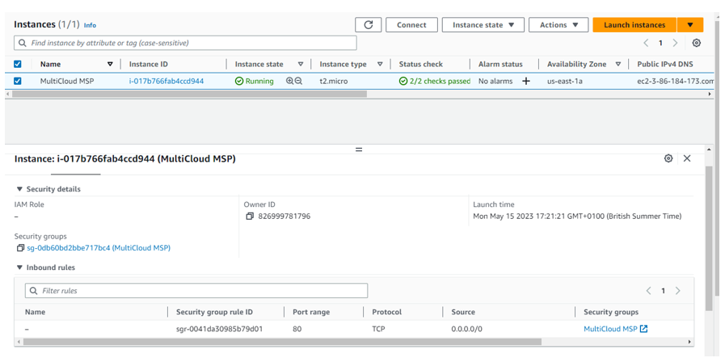
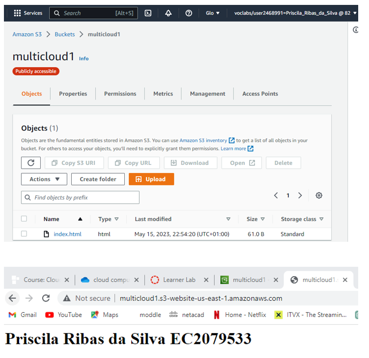
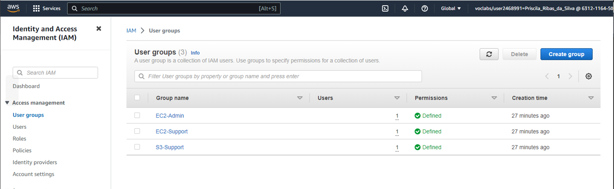

<h1><a href="https://github.com/prsilvaa"> Cloud Computing </a></h1>

<h2>Project Objective</h2>

To configure and test read/write access from an EC2 Linux instance to an S3 bucket by assigning proper IAM role permissions. This involves creating and configuring the S3 bucket, launching an EC2 instance, attaching IAM roles, and using AWS CLI commands to verify access. The solution ensures secure data exchange between EC2 and S3 services within the AWS environment.

<h2>Tools Used</h2>
<ul>
    <li>AWS Academy Learner Lab – Foundation Services</li>
    <li>AWS IAM</li>
    <li>Amazon EC2</li>
    <li>Amazon S3</li>
    <li>AWS CLI</li>
    <li>Linux Commands</li>
</ul>

<h2>Skills Gained</h2>
<ul>
    <li>Configuring IAM roles and permissions</li>
    <li>Managing EC2 instances</li>
    <li>Creating and managing S3 buckets</li>
    <li>Using AWS CLI for S3 operations</li>
    <li>Linux terminal operations</li>
</ul>

<h2>Outcome</h2>

Successful access to the S3 bucket from the EC2 Linux instance was achieved after verifying that the correct permissions were in place using AWS CLI commands. The necessary IAM role was properly attached to the EC2 instance, granting it the required read and write access to the specified S3 bucket. Using a combination of AWS CLI and standard Linux commands, the required text file was successfully accessed and copied from the S3 bucket to the local EC2 instance. This confirmed that the IAM policy was correctly configured and that the instance had the appropriate permissions to interact with the S3 bucket as intended.

    <h3>EC2 Instance Setup</h3>
    
    
EC2 Linux instance launched with Ubuntu 20.04 LTS, configured for secure access and AWS CLI installation.

    <h3>S3 Bucket Configuration</h3>
    
    
S3 bucket created with public access disabled. Text file uploaded to bucket for read/write access testing.

    <h3>IAM Role Permissions</h3>
    
    
IAM LabRole modified by attaching AmazonS3FullAccess policy to enable S3 bucket access from EC2 instance.

